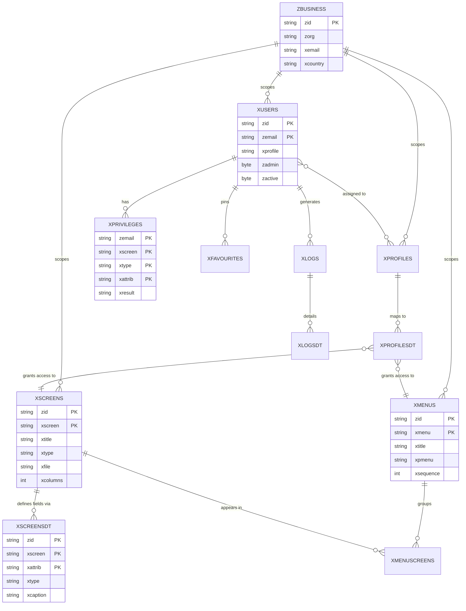

# Technical Deep Dive — ERP Metadata Engine & Sample Screen Spec

Companion document to the [main case study](./CASE_STUDY.md). This shows two concrete artifacts from the design: the **core metadata schema** that drives the UI engine, and a **sample functional screen specification** (Purchase Order), reformatted here for readability.

---

## 1. Core Metadata Schema (ER Diagram)

Every business entity in the system is scoped by `zbusiness`, and every screen/menu/privilege is data-driven rather than hardcoded. This is the schema layer that powers the low-code-style rendering engine.

**Design notes:**
- `xscreens` + `xscreensdt` together define a screen's fields, captions, and types purely as data — the rendering engine reads this at runtime rather than each screen being a separate hardcoded form.
- `xprivileges` resolves access **per user, per screen, per field (`xattrib`)** — enabling field-level (not just module-level) permissioning.
- `xprofiles` + `xprofilesdt` implement role-based templates that bulk-assign menu/screen access, so onboarding a new user role doesn't require custom code.

---

## 2. Sample Functional Screen Specification — `PO14: Purchase Order`

Every transactional screen in the system follows the same specification pattern: field definitions with validation rules, plus explicit button-level business logic. Below is a condensed version of the Purchase Order screen spec.

### Field Definitions

| Field | Caption | Input Type | Validation | Default | Source |
|---|---|---|---|---|---|
| `xpornum` | Order No. | Search | Required | Auto-generated | Transaction sequence |
| `xdate` | Date | Calendar | Required | Today | — |
| `xhwh` | Project/Business | Search | Required | — | Business/Project master |
| `xwh` | Site/Store | Search | Required | Dependent (Ajax) | Filtered by selected Project |
| `xcus` | Supplier | Search | Required | — | Supplier master |
| `xtotamt` | Total Amount | Calculated | Required on Add | 0.00 | Sum of line items |
| `xporeqnum` | Requisition No. | Search | Optional | — | Linked Purchase Requisition |
| `xquotnum` | Quotation No. | Search | Optional | Dependent (Ajax) | Linked Supplier Quotation |
| `xstatus` | Status | System | Required on Add | "Open" | Workflow state |
| `xdatedel` | Expected Delivery | Calendar | Required | Today | — |
| `xstaff` | Preparer | Search | Required | — | Employee master, session user |

### Button-Level Business Logic

**Show**
Loads the order header where `business = current business AND order no. = selected AND screen = PO14`. Returns a "no data found" error if the record doesn't exist.

**Add**
1. Validates all required fields; returns field-specific error messages on failure.
2. Generates the next order number via a shared transaction-numbering service (keyed by business + screen code), guaranteeing uniqueness without a separate sequence table per screen.
3. Persists the record and reloads it to confirm the save.

**Update**
Only enabled while the order status is "Open." Re-validates required fields, then saves changes scoped to the same business + order number + screen key.

**Delete**
Only enabled while status is "Open," and only if no dependent line-item records exist — otherwise the system blocks deletion with a "delete detail first" message, preventing orphaned child records.

**Confirm**
Transitions the order out of "Open" status, locking header-level edits and enabling downstream actions such as **Create GRN** (Goods Receipt Note), which carries the order forward into the receiving workflow.

### Why this pattern matters
This same Add/Update/Delete/Confirm lifecycle — with status-gated buttons, a shared numbering service, and referential-integrity checks before deletion — is reused consistently across all ~100 transaction screens (Purchase Requisition, Sales Order, GRN, Stock Adjustment, etc.). Documenting it once at the pattern level, rather than re-specifying it per screen, is what kept a system of this size buildable by a small development team.

---

*This is a reformatted excerpt for portfolio purposes. The original document specifies validation rules, workflow states, and field-level business logic for 100+ screens in this level of detail.*
